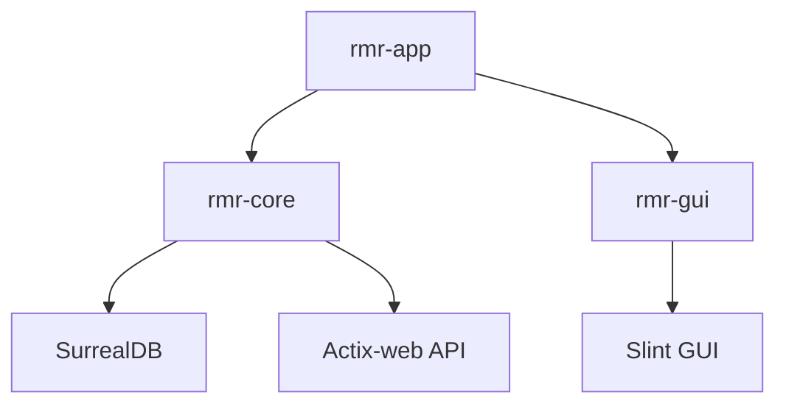

# Rusted Moonraker (RMR) Architecture

Rusted Moonraker (RMR) transitions the Moonraker backend from a dynamic, interpreted Python runtime (Tornado) to a statically typed, compiled, concurrent Rust system. To guarantee high performance, absolute thread safety, and zero UI stutter on embedded hardware, the system is built around several core components and design patterns.

---

## 1. Architectural Topology & Design Patterns

### The Actor Pattern for UDS Communication
The connection to Klipper via the Unix Domain Socket (UDS) is treated as an isolated, stateful Actor (`KlippyConnectionActor`).
- The actor owns the UDS socket connection and handles automatic recovery and exponential backoffs (ranging from 1s up to 32s limit).
- The actor communicates with the rest of the application exclusively through messages.
- Command requests are received via a multi-producer single-consumer (`mpsc`) channel.
- Telemetry updates (temperatures, position coordinates, printing status) are pushed out via a single-producer multi-consumer `watch` channel.

### SurrealDB Transactional Local Storage
Database management utilizes SurrealDB configured with the pure-Rust file-backed `kv-surrealkv` local storage engine (and `kv-mem` for testing).
- Maintains transaction-safe logs for print history and G-code file metadata.
- Prevents database corruption from multiple instances using transactional lock file checks.

### Memory-Mapped Zero-Copy G-code Analyzer
To prevent heavy files from blocking executor threads, the G-code parsing pipeline (`analyzer.rs`) uses memory-mapped file access (`memmap2::Mmap`).
- Performs regex searches on the first and last 64KB chunks of files to extract metadata (estimated print times, layer height, slicer type) and base64 PNG thumbnails.
- Extracted thumbnails are decoded and cached locally as `.png` files under `~/.config/rmr/thumbnails/`.

### Integrated Slint Touchscreen GUI
The frontend runs as part of the same process, loading `MainWindow` from the `rmr-gui` crate.
- Pushes Klipper state updates from the watch channel to Slint properties on the main thread via thread-safe `slint::invoke_from_event_loop` handlers.
- Transmits user commands (Emergency Stop, G-code macros, temperature presets) back to the tokio runtime thread pool.

---

## 2. Workspace Crate Components

RMR is organized as a multi-crate workspace:

### `rmr-core`
The engine of the application.
- `config/`: Parse INI config blocks and validate host ports.
- `db/`: SurrealDB instance wrapper, migration loader, and lockfiles.
- `klippy/`: JSON-RPC line codec and `KlippyConnectionActor`.
- `files/`: Memory-mapped metadata scanner and async directory crawler.
- `web/`: Actix routes, WebSocket frames broker, IP authorization filters.

### `rmr-gui`
Exposes the compiled GUI module interface and layout code (`ui/app.slint`).

### `rmr-app`
The executable entry point. Initializes the Tokio multi-threaded runtime, sets up DB and actors, spawns background web services, and drives the Slint window loop on the main thread.
